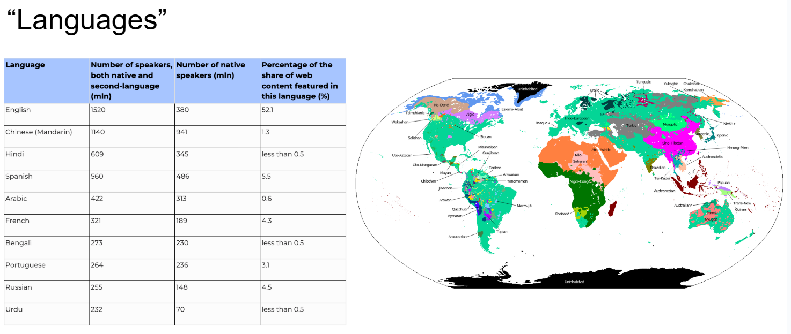
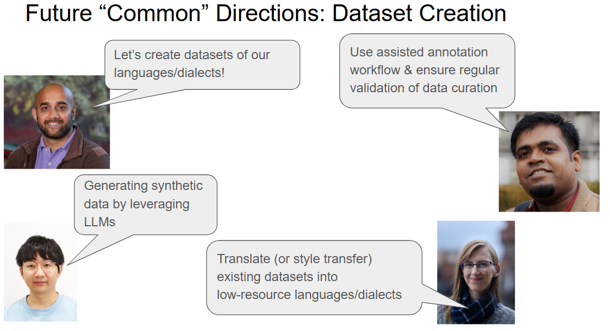

# COLING Tutorial on Low-resource Scenarios 2025
The official repo for the tutorial "**Connecting Ideas in *Lower-Resource* Scenarios: NLP for National Varieties, Creoles, and Other Low-resource Languages**" in The 31st International Conference on Computational Linguistics (**COLING 2025**).

<!---

-->
## Programme

**Date**: **Mon Jan 20, 2025** (The second day in COLING 2025)  

**Tutorial Type**: In-Person, Full Day from 9:00 AM to 5:30 PM

**Location**: **Conference Hall B (C)** 

| **Time**       | **Session**                                                                                                      |
|----------------|-------------------------------------------------------------------------------------------------------------------|
| 09:00 - 9:45  | **Module 1**: Introduction |
| 09:45 - 10:30  | **Module 2**: Emerging Connections |
| 10:30 - 11:00  | **Coffee Break**                                                                                                  |
| 11:00 - 12:00  | **Module 3**: Common Ideas in Dataset Creation |
| 12:00 - 13:00  | **Lunch Break**                                                                                                   |
| 13:00 - 14:30  | **Module 4**: Common Themes in Understanding |
| 14:30 - 15:30  | **Module 5**: Common Themes in Generation |
| 15:30 - 16:00  | **Coffee Break**                                                                                                  |
| 16:00 - 17:00  | **Module 5 (Continued)** |
| 17:00 - 17:30  | **Module 6**: Conclusion & Recap |

---
## Slides 
| | |
|-|-|
|  | Module 1: Introduction [slide](#) |
|  | Module 2: Emerging Connections [slide](#) |
|  | Module 3: Common Ideas in Dataset Creation [slide](#) |
|  | Module 4: Common Themes in Understanding [slide](#) |
|  | Module 5: Common Themes in Generation [slide](#) |
|  | Module 6: Conclusion / Recap [slide](#) |
---

## Presenters

|                         |                                                                                           |
|-------------------------|-------------------------------------------------------------------------------------------|
|  | <a href="https://tinyurl.com/SbYRrvgAAAAJ" style="color:#D42D50; text-decoration:underline;"><b>Aditya Joshi</b></a><br/>University of New South Wales, Australia.<br/>His research focuses on NLP for English dialects and optimization of NLP models. He has taught large and specialized NLP courses and has presented tutorials at EMNLP (2017) and AACL (2020). |
|  | <a href="https://tinyurl.com/UNCgCAEAAAAJ" style="color:#D42D50; text-decoration:underline;"><b>Diptesh Kanojia</b></a><br/>University of Surrey, United Kingdom.<br/>Works on quality estimation, social NLP, and low-resource NLP. Previously presented a tutorial on Unsupervised NMT (ICON 2020). Co-organizer for WMT shared tasks on QE and APE. |
|  | <a href="https://scholar.google.com/citations?user=ZxdpWo4AAAAJ&hl=en" style="color:#D42D50; text-decoration:underline;"><b>Heather Lent</b></a><br/>Aalborg University, Denmark.<br/>Postdoctoral researcher focusing on Creole NLP, low-resource domains, and NLP security. Has publications in TACL, ACL, EMNLP, COLING, and LREC. |
|  | <a href="https://tinyurl.com/zJ0wGWoAAAAJhl" style="color:#D42D50; text-decoration:underline;"><b>Hour Kaing</b></a><br/>National Institute of Information and Communications Technology (NICT), Japan.<br/>Researcher on linguistic analysis, MT, language modeling, and speech processing. Tutorial presenter at EAMT 2024. |
|  | <a href="https://shyyhs.github.io/" style="color:#D42D50; text-decoration:underline;"><b>Haiyue Song</b></a><br/>National Institute of Information and Communications Technology (NICT), Japan.<br/>Ph.D. from Kyoto University. Interests: MT, LLMs, subword segmentation, and decoding. Previously presented a tutorial at EAMT 2024. |

---

## Abstract 

Despite excellent results on benchmarks over a small subset of languages, large language models struggle to process text from languages situated in ‘lower-resource’ scenarios such as dialects/sociolects (national or social varieties of a language), Creoles (languages arising from linguistic contact between multiple languages) and other low-resource languages. This introductory tutorial will identify common challenges, approaches, and themes in natural language processing (NLP) research for confronting and overcoming the obstacles inherent to data-poor contexts. By connecting past ideas to the present field, this tutorial aims to ignite collaboration and cross-pollination between researchers working in these scenarios. Our notion of ‘lower-resource’ broadly denotes the outstanding lack of data required for model training - and may be applied to scenarios apart from the three covered in the tutorial.

---

## Citation

```bibtex
@misc{joshi2025colingtutorial,
Author = {Aditya Joshi and Diptesh Kanojia and Heather Lent and Hour Kaing and Haiyue Song},
Title = {Connecting Ideas in 'Lower-Resource' Scenarios: NLP for National Varieties, Creoles and Other Low-resource Scenarios},
Year = {2024},
Eprint = {arXiv:2409.12683},
}
